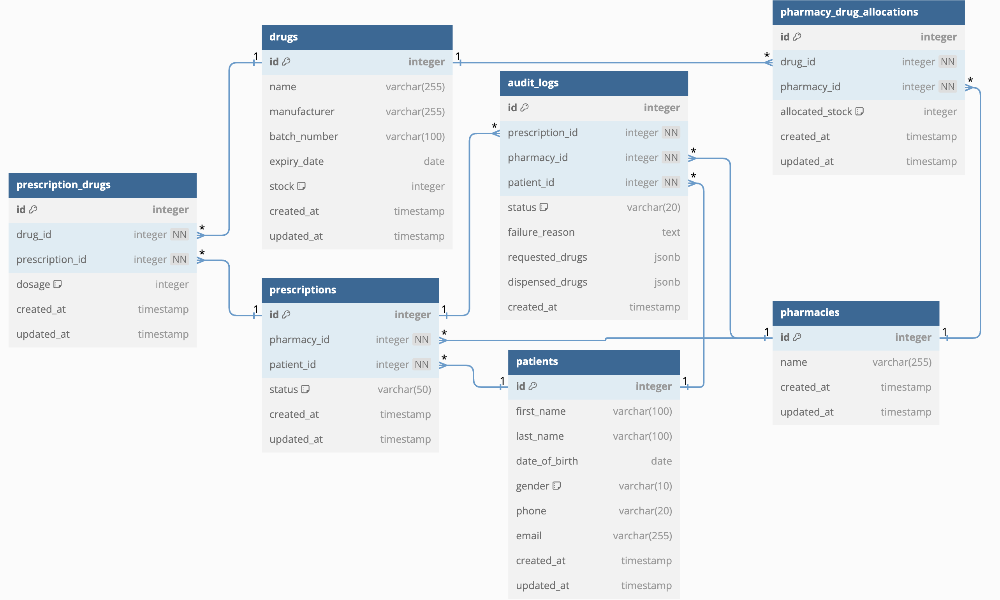
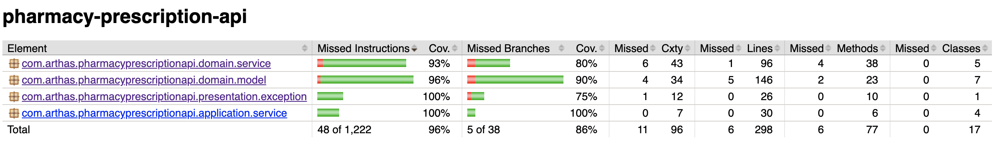

# Pharma Supply Chain and Prescription Fulfillment System

## 📌 Project Overview
The **Pharma Supply Chain and Prescription Fulfillment System** is designed to manage pharmaceutical inventory, prescription fulfillment, and pharmacy operations efficiently. The system ensures that prescriptions are only fulfilled when all drugs are available, within the pharmacy's allocation, and not expired.

This project follows **Onion Architecture**, **Domain-Driven Design (DDD)**, and **RESTful API** best practices.

---

## 🚀 Tech Stack
- **Backend:** Java 23, Spring Boot 3, Spring Data JPA, Spring Web
- **Database:** IBM DB2 (or PostgreSQL as an alternative)
- **ORM:** Hibernate
- **Containerization:** Docker, Docker Compose
- **Build Tool:** Gradle 8
- **Testing:** JUnit 5, Mockito
- **Linting & Code Quality:** Checkstyle

---

## 🛠 Features
- **Pharmacy Management:** Stores pharmacy details and allocated drugs.
- **Drug Inventory Management:** Tracks stock levels, expiry dates, and batch numbers.
- **Prescription Processing:** Validates prescriptions, ensures stock availability, and updates fulfillment status.
- **Audit Logging:** Records all prescription attempts, including failures and reasons.
- **Concurrency Handling:** Prevents race conditions in stock updates using transactions.
- **RESTful APIs:** CRUD operations for drugs, pharmacies, prescriptions, and fulfillment.

---

## ERD Diagram


---

## 📌 RESTful API Capability

### ✅ Implemented APIs

#### **Drug Management**
| **Feature** | **HTTP Method** | **Endpoint** | **Request Parameters**                            | **Request Body** | **Response** |
|------------|---------------|-------------|---------------------------------------------------|---------------|-------------|
| **Add a Drug** | `POST` | `/api/drugs` | None                                              | `{ "name": "Paracetamol", "manufacturer": "XYZ Pharma", "batchNumber": "B123", "expiryDate": "2026-12-31", "stock": 100 }` | `{ "id": 1, "name": "Paracetamol", "manufacturer": "XYZ Pharma", "batchNumber": "B123", "expiryDate": "2026-12-31", "stock": 100 }` |
| **Retrieve All Pharmacies (Paginated)** | `GET` | `/api/pharmacies` | `page=X&size=Y`                                   | None | `{ "content": [ { "id": 1, "name": "Central Pharmacy", "drugs": [ { "id": 1, "name": "Paracetamol", "batchNumber": "B123", "stock": 100 } ] }], "totalElements": 25, "totalPages": 3, "size": 10, "number": 0 }` |
| **Create a Prescription** | `POST` | `/api/prescriptions` | None                                              | `{ "patientId": 1, "pharmacyId": 2, "drugs": [ { "drugId": 101, "dosage": 2 }, { "drugId": 102, "dosage": 1 } ] }` | `{ "id": 1, "status": "PENDING", "drugs": [ { "id": 101, "name": "Paracetamol", "dosage": 2 }, { "id": 102, "name": "Ibuprofen", "dosage": 1 } ] }` |
| **Fulfill a Prescription** | `POST` | `/api/prescriptions/{prescriptionId}/fulfill` | `prescriptionId`                                  | None | `{ "id": 1, "status": "FULFILLED", "drugs": [ { "id": 101, "name": "Paracetamol", "dosage": 2 }, { "id": 102, "name": "Ibuprofen", "dosage": 1 } ] }` |
| **Get Audit Logs (Filtered)** | `GET` | `/api/audit-logs` | `patientId=X&pharmacyId=Y&status=SUCCESS/FAILURE` | None | `{ "logs": [ { "prescriptionId": 1, "patientId": 1, "pharmacyId": 2, "status": "FULFILLED", "timestamp": "2025-02-11T01:08:02.137932" } ] }` |

---

## 📦 Folder Structure

The project follows the **Onion Architecture** with **Domain-Driven Design (DDD)** principles. Each entity has its own domain, application, infrastructure, and presentation layers.


Below is an example of the project's folder structure for `Drug` entity:
```
java/com/arthas/pharmacyprescriptionapi
 ├── domain
 │   ├── model
 │   │   ├── DrugDomain.java
 │   ├── repository
 │   │   ├── DrugRepositoryInterface.java
 │   ├── service
 │   │   ├── DrugDomainService.java
 ├── application
 │   ├── service
 │   │   ├── DrugApplicationService.java
 ├── infrastructure
 │   ├── repository
 │   │   ├── DrugRepositoryImpl.java
 │   ├── schema
 │   │   ├── DrugSchema.java
 ├── presentation
 │   ├── controller
 │   │   ├── DrugController.java
 │   ├── dto
 │   │   ├── DrugRepresentation.java
 │   │   ├── CreateDrugCommand.java
 ├── tests
 │   ├── application
 │   │   ├── DrugApplicationServiceTest.java
 │   ├── domain
 │   │   ├── DrugDomainServiceTest.java
 │   ├── dto
 │   │   ├── DrugControllerTest.java
 ```

## **Concurrency Control Strategies for Stock Deduction**

| Strategy                  | Suitable Scenario      | Concurrency Control | Performance Impact | Best Use Case |
|---------------------------|-----------------------|---------------------|--------------------|---------------|
| **Optimistic Locking**    | Read-heavy workloads, occasional conflicts | Version control (`version` field) + retry mechanism | Low | High-performance systems with moderate contention |
| **Pessimistic Locking**   | High-contention scenarios | Transaction-level locks (`SELECT ... FOR UPDATE`) | High | Small-scale systems with limited stock updates |
| **Transaction Isolation** | Prevents dirty reads, avoids inconsistency | Database isolation levels (e.g., `REPEATABLE READ`) | Medium | General stock management where moderate consistency is needed |
| **Distributed Locking**   | Multi-instance distributed environments | Redis/Zookeeper-based locking | Medium | Scenarios with multiple service nodes updating shared stock |
| **Event-Driven Approach** | High-throughput, large-scale systems | Message queues (Kafka/RabbitMQ) for async processing | Low | Large-scale inventory systems that require eventual consistency |

### **Tech Consideration: Choose Optimistic Locking**
In our system, **Optimistic Locking** is the best fit for handling stock updates efficiently. Since we operate in a **high-performance environment with moderate contention**, using a `version` field along with retry logic ensures **data consistency without introducing unnecessary locking overhead**. </br>
Additionally, we leverage **transaction isolation (`REPEATABLE READ`)** to prevent inconsistent reads while keeping the system scalable. This approach minimizes database contention, allowing multiple users to interact with the inventory system concurrently without significant performance degradation. </br>

--- 

## 🏗️ Setup Instructions
### 1️⃣ Prerequisites
Ensure you have the following installed:
- **Java 23+**: `java -version`
- **Gradle 8+**: `./gradlew --version`
- **Docker & Docker Compose**: `docker -v && docker-compose -v`

### 2️⃣ Clone the Repository
```sh
git clone https://github.com/arthaszeng/pharma-supply-chain.git
cd pharma-supply-chain
```

### 3️⃣ Configure the Database
#### **Option 1: Use DB2 with Docker**
```sh
docker-compose up -d
```
This starts an **IBM DB2** instance with the required schema.

#### **Option 2: Use PostgreSQL (Alternative)**
If DB2 does not work on ARM/Mac M1/M2, modify `docker-compose.yml` to use PostgreSQL:
```yaml
  postgres:
    image: postgres:15
    environment:
      POSTGRES_DB: pharma_db
      POSTGRES_USER: pharma_user
      POSTGRES_PASSWORD: yourpassword
```
Then run:
```sh
docker-compose up -d
```

### 4️⃣ Configure Application Properties
Modify `src/main/resources/application.properties` to match your database:
```properties
spring.datasource.url=jdbc:db2://db2:50000/pharma_db
spring.datasource.username=db2inst1
spring.datasource.password=yourpassword
spring.jpa.database-platform=org.hibernate.dialect.DB2Dialect
```
For PostgreSQL:
```properties
spring.datasource.url=jdbc:postgresql://postgres:5432/pharma_db
spring.datasource.username=pharma_user
spring.datasource.password=yourpassword
spring.jpa.database-platform=org.hibernate.dialect.PostgreSQLDialect
```

### 5️⃣ Build & Run the Application
```sh
./gradlew build
./gradlew bootRun
```
If running with Docker:
```sh
docker-compose up --build
```

### 6️⃣ Test APIs
Verify the API is running:
```sh
curl http://localhost:8080/actuator/health
```
Expected response:
```json
{"status":"UP"}
```

---

## 📌 API Documentation
### **1. Add a Drug**
```http
POST /api/drugs
```
#### **Request Body**
```json
{
  "name": "Paracetamol",
  "manufacturer": "XYZ Pharma",
  "batchNumber": "B12345",
  "expiryDate": "2025-12-31",
  "stock": 100
}
```
#### **Response**
```json
{
  "id": 4,
  "name": "Paracetamol",
  "manufacturer": "XYZ Pharma",
  "batchNumber": "B12345",
  "expiryDate": "2025-12-31",
  "stock": 100
}
```

#### **Error Response**
```json
{
  "status": 400,
  "error": "Bad Request",
  "message": "Batch number already exists",
  "path": "/api/drugs",
  "timestamp": "2025-02-11T08:16:17.110526"
}
```

---

### **2. Get All Pharmacies and Their Contracted Drugs(Paginated)**
```http
GET /api/pharmacies?page=0&size=10
```

#### **Response**
```json
{
  "content": [
    {
      "id": 1,
      "name": "Central Pharmacy",
      "drugs": [
        {
          "id": 1,
          "name": "Paracetamol",
          "manufacturer": "GSK",
          "batchNumber": "GSK001",
          "expiryDate": "2025-12-30T16:00:00.000+00:00",
          "stock": 100
        },
        {
          "id": 2,
          "name": "Ibuprofen",
          "manufacturer": "Bayer",
          "batchNumber": "BAY001",
          "expiryDate": "2025-12-30T16:00:00.000+00:00",
          "stock": 50
        }
      ]
    },
    {
      "id": 2,
      "name": "Downtown Pharmacy",
      "drugs": [
        {
          "id": 1,
          "name": "Paracetamol",
          "manufacturer": "GSK",
          "batchNumber": "GSK001",
          "expiryDate": "2025-12-30T16:00:00.000+00:00",
          "stock": 100
        }
      ]
    }
  ],
  "pageable": {
    "pageNumber": 0,
    "pageSize": 10,
    "sort": {
      "empty": true,
      "sorted": false,
      "unsorted": true
    },
    "offset": 0,
    "paged": true,
    "unpaged": false
  },
  ...,
  "numberOfElements": 2,
  "empty": false
}
```

---

### **3. Create a Prescription**
```http
POST /api/prescriptions
```
#### **Request Body**
```json
{
  "patientId": 1,
  "pharmacyId": 1,
  "drugs": [
    {
      "drugId": 2,
      "dosage": 10
    },
    {
      "drugId": 1,
      "dosage": 5
    }
  ]
}
```
#### **Response**
```json
{
  "id": 3,
  "status": "PENDING",
  "drugs": [
    {
      "drugId": 2,
      "name": "Ibuprofen",
      "batchNumber": "BAY001",
      "dosage": 10
    },
    {
      "drugId": 1,
      "name": "Paracetamol",
      "batchNumber": "GSK001",
      "dosage": 5
    }
  ]
}
```

#### **Error Response**
```json
{
  "status": 400,
  "error": "Bad Request",
  "message": "Patient ID 3 does not exist",
  "path": "/api/prescriptions",
  "timestamp": "2025-02-11T08:18:13.527818"
}
```
```json
{
  "status": 400,
  "error": "Bad Request",
  "message": "Insufficient or missing stock for Drug ID 3",
  "path": "/api/prescriptions",
  "timestamp": "2025-02-11T08:19:08.412024"
}
```

---

### **4. Fulfill a Prescription**
```http
POST /api/prescriptions/fulfill/{id}
```
#### **Response**
```json
{
  "id": 3,
  "status": "FULFILLED",
  "drugs": [
    {
      "drugId": 2,
      "name": "Ibuprofen",
      "batchNumber": "BAY001",
      "dosage": 10
    },
    {
      "drugId": 1,
      "name": "Paracetamol",
      "batchNumber": "GSK001",
      "dosage": 5
    }
  ]
}
```

#### **Error Response**

```json
{
  "status": 400,
  "error": "Bad Request",
  "message": "Insufficient or missing stock for Drug ID 1",
  "path": "/api/prescriptions/4/fulfill",
  "timestamp": "2025-02-11T08:11:48.375382"
}
```

```json
{
  "status": 400,
  "error": "Bad Request",
  "message": "Prescription ID 5 does not exist.",
  "path": "/api/prescriptions/5/fulfill",
  "timestamp": "2025-02-11T08:15:15.885331"
}
```

---

### **5. Get Audit Logs**
```http
GET /api/audit-logs?patientId=1&pharmacyId=1
```
#### **Response**
```json
{
  "content": [
    {
      "id": 1,
      "prescriptionId": 3,
      "patientId": 1,
      "pharmacyId": 1,
      "status": "SUCCESS",
      "failureReason": "N/A",
      "requestedDrugs": [
        {
          "name": "Ibuprofen",
          "drugId": 2,
          "quantity": 10
        },
        {
          "name": "Paracetamol",
          "drugId": 1,
          "quantity": 5
        }
      ],
      "dispensedDrugs": [
        {
          "name": "Ibuprofen",
          "drugId": 2,
          "quantity": 10
        },
        {
          "name": "Paracetamol",
          "drugId": 1,
          "quantity": 5
        }
      ],
      "createdAt": "2025-02-11T08:07:52.906442"
    },
    {
      "id": 2,
      "prescriptionId": 4,
      "patientId": 1,
      "pharmacyId": 1,
      "status": "FAILURE",
      "failureReason": "Insufficient or missing stock for Drug ID 1",
      "requestedDrugs": [
        {
          "name": "Ibuprofen",
          "drugId": 2,
          "quantity": 3
        },
        {
          "name": "Paracetamol",
          "drugId": 1,
          "quantity": 5
        }
      ],
      "dispensedDrugs": [],
      "createdAt": "2025-02-11T08:11:29.785731"
    }
  ],
  "pageable": {
    "pageNumber": 0,
    "pageSize": 20,
    "sort": {
      "empty": true,
      "sorted": false,
      "unsorted": true
    },
    "offset": 0,
    "paged": true,
    "unpaged": false
  },
  ...,
  "numberOfElements": 2,
  "empty": false
}
```

---

## 🧪 Running Tests
Run unit tests using JUnit:
```sh
./gradlew test
```

Generate test coverage report:
```sh
./gradlew clean test jacocoTestReport
```

## **Test Coverage**


---

## 📌 Linting & Code Quality
Checkstyle is used for code formatting:
```sh
./gradlew checkstyleMain
```

---

## 🔥 Assumptions & Notes
- **IBM DB2** is the primary database, but PostgreSQL is supported for easier setup.
- **Transactions** ensure concurrent prescription fulfillment does not cause stock inconsistencies.
- **Docker Compose** is optional, and you can run the database manually if needed.

---

## 📜 License
MIT License

---

## 👨‍💻 Author
- **Your Name** – [GitHub](https://github.com/arthaszeng)