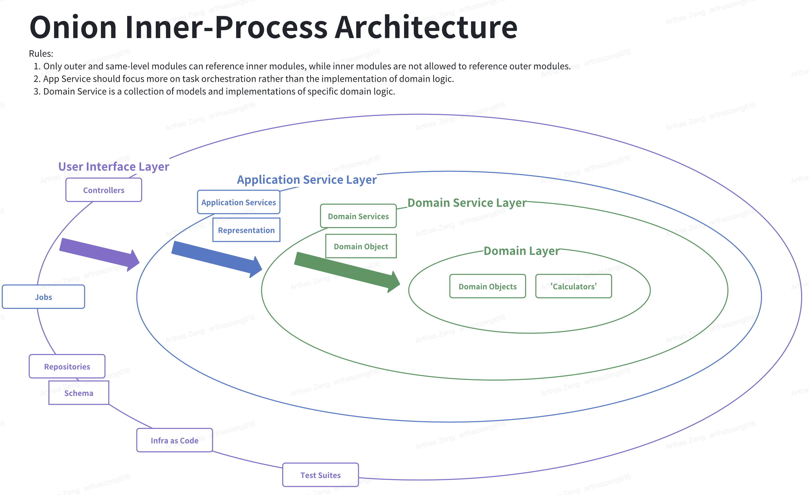

# Pharma Supply Chain and Prescription Fulfillment System

## 📌 Project Overview
The **Pharma Supply Chain and Prescription Fulfillment System** is designed to manage pharmaceutical inventory, prescription fulfillment, and pharmacy operations efficiently. The system ensures that prescriptions are only fulfilled when all drugs are available, within the pharmacy's allocation, and not expired.

This project follows **Onion Architecture**, **Domain-Driven Design (DDD)**, and **RESTful API** best practices.

---

## 🚀 Tech Stack
- **Backend:** Java 23, Spring Boot 3, Spring Data JPA, Spring Web
- **Database:** IBM DB2 (or PostgreSQL as an alternative)
- **ORM:** Hibernate
- **Containerization:** Docker, Docker Compose
- **Build Tool:** Gradle 8
- **Testing:** JUnit 5, Mockito
- **Linting & Code Quality:** Checkstyle

---

## 🛠 Features
- **Pharmacy Management:** Stores pharmacy details and allocated drugs.
- **Drug Inventory Management:** Tracks stock levels, expiry dates, and batch numbers.
- **Prescription Processing:** Validates prescriptions, ensures stock availability, and updates fulfillment status.
- **Audit Logging:** Records all prescription attempts, including failures and reasons.
- **Concurrency Handling:** Prevents race conditions in stock updates using transactions.
- **RESTful APIs:** CRUD operations for drugs, pharmacies, prescriptions, and fulfillment.

---

# 📌 RESTful API Capability Table

## ✅ Implemented APIs

| **Feature** | **HTTP Method** | **Endpoint** | **Request Parameters** | **Request Body** | **Response** |
|------------|---------------|-------------|----------------|---------------|-------------|
| **Add a Drug** | `POST` | `/api/drugs` | None | `{ "name": "Paracetamol", "manufacturer": "XYZ Pharma", "batchNumber": "B123", "expiryDate": "2026-12-31", "stock": 100 }` | `{ "id": 1, "name": "Paracetamol", "manufacturer": "XYZ Pharma", "batchNumber": "B123", "expiryDate": "2026-12-31", "stock": 100 }` |
| **Get All Drugs (Paginated)** | `GET` | `/api/drugs?page=X&size=Y` | `page` (default: 0), `size` (default: 10) | None | `{ "content": [{ "id": 1, "name": "Paracetamol", "batchNumber": "B123", "stock": 100 }], "totalElements": 100, "totalPages": 10, "size": 10 }` |
| **Get Drug by Batch Number** | `GET` | `/api/drugs/{batchNumber}` | `batchNumber` | None | `{ "id": 1, "name": "Paracetamol", "manufacturer": "XYZ Pharma", "batchNumber": "B123", "expiryDate": "2026-12-31", "stock": 100 }` |

---

## 📌 Planned APIs

| **Feature** | **HTTP Method** | **Endpoint** | **Status** |
|------------|---------------|-------------|----------|
| **Update Drug Information** | `PUT` | `/api/drugs/{batchNumber}` | 🚧 Pending Implementation |
| **Delete a Drug** | `DELETE` | `/api/drugs/{batchNumber}` | 🚧 Pending Implementation |
| **Create a Prescription** | `POST` | `/api/prescriptions` | 🚧 Pending Implementation |
| **Get Prescription by ID** | `GET` | `/api/prescriptions/{id}` | 🚧 Pending Implementation |
| **Get All Prescriptions** | `GET` | `/api/prescriptions` | 🚧 Pending Implementation |
| **Fulfill a Prescription (Drug Deduction)** | `POST` | `/api/prescriptions/{id}/fulfill` | 🚧 Pending Implementation |

---

## 📦 Folder Structure

The project follows the **Onion Architecture** with **Domain-Driven Design (DDD)** principles. Each entity has its own domain, application, infrastructure, and presentation layers.




Below is an example of the project's folder structure for `Drug` entity:
```
java/com/arthas/pharmacyprescriptionapi
 ├── domain
 │   ├── model
 │   │   ├── DrugDomain.java
 │   ├── repository
 │   │   ├── DrugRepositoryInterface.java
 │   ├── service
 │   │   ├── DrugDomainService.java
 ├── application
 │   ├── service
 │   │   ├── DrugApplicationService.java
 ├── infrastructure
 │   ├── repository
 │   │   ├── DrugRepositoryImpl.java
 │   ├── schema
 │   │   ├── DrugSchema.java
 ├── presentation
 │   ├── controller
 │   │   ├── DrugController.java
 │   ├── dto
 │   │   ├── DrugRepresentation.java
 │   │   ├── CreateDrugCommand.java
 ├── tests
 │   ├── application
 │   │   ├── DrugApplicationServiceTest.java
 │   ├── domain
 │   │   ├── DrugDomainServiceTest.java
 │   ├── dto
 │   │   ├── DrugControllerTest.java
 ```

## 🏗️ Setup Instructions
### 1️⃣ Prerequisites
Ensure you have the following installed:
- **Java 23+**: `java -version`
- **Gradle 8+**: `./gradlew --version`
- **Docker & Docker Compose**: `docker -v && docker-compose -v`

### 2️⃣ Clone the Repository
```sh
git clone https://github.com/arthaszeng/pharma-supply-chain.git
cd pharma-supply-chain
```

### 3️⃣ Configure the Database
#### **Option 1: Use DB2 with Docker**
```sh
docker-compose up -d
```
This starts an **IBM DB2** instance with the required schema.

#### **Option 2: Use PostgreSQL (Alternative)**
If DB2 does not work on ARM/Mac M1/M2, modify `docker-compose.yml` to use PostgreSQL:
```yaml
  postgres:
    image: postgres:15
    environment:
      POSTGRES_DB: pharma_db
      POSTGRES_USER: pharma_user
      POSTGRES_PASSWORD: yourpassword
```
Then run:
```sh
docker-compose up -d
```

### 4️⃣ Configure Application Properties
Modify `src/main/resources/application.properties` to match your database:
```properties
spring.datasource.url=jdbc:db2://db2:50000/pharma_db
spring.datasource.username=db2inst1
spring.datasource.password=yourpassword
spring.jpa.database-platform=org.hibernate.dialect.DB2Dialect
```
For PostgreSQL:
```properties
spring.datasource.url=jdbc:postgresql://postgres:5432/pharma_db
spring.datasource.username=pharma_user
spring.datasource.password=yourpassword
spring.jpa.database-platform=org.hibernate.dialect.PostgreSQLDialect
```

### 5️⃣ Build & Run the Application
```sh
./gradlew build
./gradlew bootRun
```
If running with Docker:
```sh
docker-compose up --build
```

### 6️⃣ Test APIs
Verify the API is running:
```sh
curl http://localhost:8080/actuator/health
```
Expected response:
```json
{"status":"UP"}
```

---

## 📌 API Documentation
### **1. Add a Drug**
```http
POST /api/drugs
```
#### **Request Body**
```json
{
  "name": "Paracetamol",
  "manufacturer": "ABC Pharma",
  "batchNumber": "BATCH123",
  "expiryDate": "2025-12-31",
  "stock": 100
}
```
#### **Response**
```json
{"message": "Drug added successfully"}
```

### **2. Create a Prescription**
```http
POST /api/prescriptions
```
#### **Request Body**
```json
{
  "patientId": 1,
  "pharmacyId": 2,
  "items": [
    { "drugId": 1, "quantity": 10 }
  ]
}
```
#### **Response**
```json
{"message": "Prescription created successfully"}
```

### **3. Fulfill a Prescription**
```http
POST /api/prescriptions/fulfill/{id}
```
#### **Response**
```json
{"message": "Prescription fulfilled successfully"}
```

### **4. Get Audit Logs**
```http
GET /api/audit-logs
```
#### **Response**
```json
[
  {
    "prescriptionId": 1,
    "status": "SUCCESS",
    "timestamp": "2025-02-09T10:30:00Z"
  }
]
```

---

## 🧪 Running Tests
Run unit tests using JUnit:
```sh
./gradlew test
```

---

## 📌 Linting & Code Quality
Checkstyle is used for code formatting:
```sh
./gradlew checkstyleMain
```

---

## 🔥 Assumptions & Notes
- **IBM DB2** is the primary database, but PostgreSQL is supported for easier setup.
- **Transactions** ensure concurrent prescription fulfillment does not cause stock inconsistencies.
- **Docker Compose** is optional, and you can run the database manually if needed.

---

## 📜 License
MIT License

---

## 👨‍💻 Author
- **Your Name** – [GitHub](https://github.com/arthaszeng)